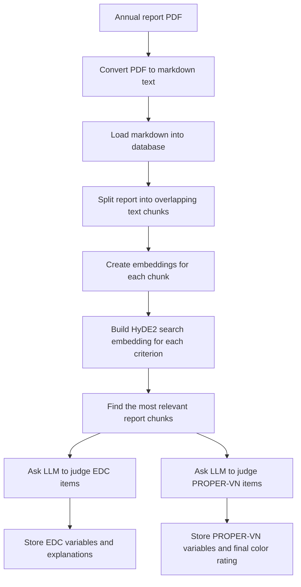

# Annual Report Pipeline Explained

## Purpose of this document

This document explains, in plain language, how the application turns a company annual report into structured research variables.

The focus here is the annual-report pipeline that produces:

- `EDC` variables: checklist-style environmental disclosure variables
- `PROPER-VN` variables: environmental rating variables

The application also contains separate workflows for governance extraction and financial-statement auditing, but those are not the main subject of this document.

## What the application is doing overall

At a high level, the application reads a company annual report, turns it into machine-readable text, breaks that text into smaller sections, and then uses AI to decide whether the report contains evidence for a series of environmental disclosure items.

Instead of asking the AI to read the entire report at once, the application first finds the most relevant sections of the report for each question. This makes the process more focused, more traceable, and easier to audit.

## The pipeline in one view

## Step 1: Converting the annual report into markdown

The process begins with an annual report in PDF form.

Many annual reports are not ready for analysis because they are scanned documents, image-heavy files, or visually formatted for people rather than for machines. The application therefore converts each PDF into markdown text.

In practical terms, the system:

- takes one report at a time
- runs OCR so text can be read even when the PDF is scanned
- writes the result into a markdown output folder
- records the conversion as a tracked job in the database

Why markdown is used:

- it is plain text, so it is easier for the system to search
- it keeps headings, paragraphs, and some document structure
- it is much lighter and easier to inspect than a PDF

The conversion step is intentionally strict. The code forces OCR so the application treats the document as something to be re-read carefully, even if the PDF already contains partial text.

## Step 2: Loading the markdown into the database

After conversion, the markdown file is loaded into the main database as the official text version of that company-year report.

During this step, the application:

- identifies the company ticker and year from the file location or filename
- reads the markdown file content
- cleans minor formatting artifacts such as inline HTML line breaks
- stores the full text in the `annual_reports` table

The system also performs quality checks on the converted text. This is important because OCR can sometimes create broken words, strange spacing, or garbled Vietnamese characters.

So this step does not only save the text. It also asks: is this converted report reliable enough to analyze?

If the markdown looks suspicious, the database keeps warning signals so the report can be reviewed or reconverted later.

## Step 3: Breaking the report into smaller sections

Once the full report is in the database, the application does not analyze it as one giant document.

Instead, it splits the report into many smaller overlapping sections called chunks.

Why this is done:

- a long annual report is too large to search or evaluate efficiently as one block
- smaller sections make it easier to find the exact passages related to a question
- overlap reduces the risk that an important sentence is split across boundaries and lost

In the current implementation, the chunks are created from tokens rather than from pages. The default design is:

- chunk size: `512` tokens
- overlap: `128` tokens

This means each section partly repeats the end of the previous section, which helps preserve context.

## Step 4: Turning each chunk into an embedding

After the report is split into chunks, the application converts each chunk into an embedding.

An embedding is a numeric representation of meaning. You can think of it as a way to place a paragraph into a mathematical map, where similar pieces of text end up near each other.

The application uses the embedding model configured in the system settings. In the current implementation, the default is:

- model: `text-embedding-3-small`
- dimensions: `1536`

Each chunk embedding is stored in the `document_embeddings` table together with:

- company ticker
- report year
- chunk number
- original chunk text
- token count

This creates a searchable evidence library for every annual report.

## Step 5: Preparing the questions the system wants to answer

The application does not search the report with one generic question. It uses a predefined list of environmental criteria.

There are two main sets of criteria in this pipeline:

- `EDC`: environmental disclosure checklist items
- `PROPER-VN`: environmental rating indicators

These criteria are defined in the application configuration. Each one has:

- a code, such as `CC1` or `GHG3`
- a group
- a written description of what evidence should count

For example, a criterion may ask whether the report discloses greenhouse gas emissions, renewable energy use, or environmental compliance.

## Step 6: Using HyDE2 to improve search before scoring

This is one of the most important parts of the pipeline.

If the system searched the report using only the short criterion text, it could miss relevant evidence. Companies often describe environmental issues indirectly, with different wording, or in long narrative passages.

To reduce that problem, the application uses `HyDE2`.

### What HyDE2 means in plain language

HyDE2 asks the language model to imagine a short paragraph that might appear in a real annual report if the criterion were truly satisfied.

For each criterion, the system:

- starts with the original criterion description
- asks the model to generate hypothetical Vietnamese report excerpts that would satisfy that criterion
- converts both the original criterion and the hypothetical excerpts into embeddings
- averages those embeddings into one stronger search vector

In other words, instead of searching with only a short instruction, the application searches with an enriched representation of what good evidence might actually look like in a report.

### Why this matters

This improves retrieval because the system becomes better at recognizing:

- different wording for the same idea
- narrative descriptions instead of formal labels
- indirect or non-standard disclosures

### How the current implementation works

The code currently:

- generates hypothetical excerpts in Vietnamese
- creates more than one synthetic example per criterion
- includes the original criterion together with the synthetic examples
- averages all resulting embeddings into a final HyDE2 embedding
- saves caches of these generated hypotheses and embeddings so they can be reused later

By default, the implementation generates `2` synthetic documents per criterion.

## Step 7: Finding the most relevant evidence inside the report

After the system builds the HyDE2 search embedding for a criterion, it compares that search vector with all chunk embeddings from the report.

The application then ranks the chunks by similarity and keeps only the most relevant ones.

In the current implementation, the default retrieval depth is:

- top `20` chunks per criterion

This means the final judge does not see the whole report. It sees the sections most likely to contain evidence for that specific criterion.

This is the retrieval part of the RAG process:

- `R` stands for retrieval
- the system retrieves likely evidence first
- only then does the language model evaluate that evidence

## Step 8: Creating EDC variables

For `EDC`, the application evaluates each checklist item separately.

For every EDC criterion, the system:

- retrieves the most relevant report chunks using HyDE2-based search
- sends those chunks, together with the criterion description, to the language model
- asks the model whether the retrieved text truly satisfies the criterion
- stores a yes-or-no style result

The output for each EDC item includes:

- whether the item is considered valid or not
- a short explanation
- citations pointing to the chunk numbers that support the answer

This produces one structured variable per EDC item for each company-year report.

In simple terms, EDC turns the annual report into a set of research-ready disclosure flags.

## Step 9: Creating PROPER-VN variables

`PROPER-VN` uses the same general retrieval logic, but the decision structure is different.

Instead of only asking yes or no, the system evaluates environmental performance indicators in two stages.

### Stage 1: Compliance and violations

The first stage looks for evidence of:

- serious environmental violations
- minor non-compliance
- stated environmental compliance

This stage acts like a gatekeeper.

If the report suggests a serious violation, the company can be classified into the most severe category. If there is minor non-compliance without clear compliance evidence, the company is pushed into a lower category.

### Stage 2: Beyond-compliance behavior

If the company passes the first stage, the application then checks positive environmental indicators such as:

- ISO 14001 or similar systems
- carbon disclosure
- environmental targets
- cleaner technology or other stronger practices

For each Stage 2 indicator, the system stores not only whether it is present, but also the strength of the evidence:

- `none`
- `basic_mention`
- `quantified`

That is important because a vague statement and a quantified disclosure are not treated as equally strong evidence.

## Step 10: Converting PROPER-VN evidence into a final color rating

After all PROPER-VN indicators are evaluated, the application converts them into a final color result.

The logic is:

- `Black`: serious violation detected
- `Red`: minor non-compliance without convincing compliance evidence
- otherwise the company moves to Stage 2 scoring

For Stage 2, the application assigns points based on evidence strength:

- `none` = 0
- `basic_mention` = 1
- `quantified` = 2

The final rating is then determined from the total Stage 2 score:

- `Gold`: very strong beyond-compliance engagement
- `Green`: moderate beyond-compliance engagement
- `Blue`: compliant, but with weaker advanced disclosure

This is how the system turns many individual report passages into one final PROPER-VN color classification.

## Step 11: Saving results so they can be reviewed and reused

The application saves both the final variables and the supporting process data.

This includes:

- converted report text
- chunk-level embeddings
- retrieved chunk references
- EDC results and explanations
- PROPER-VN results and final color
- job status records
- request logs showing what was sent to the language model

This design matters for research and auditability. A user can inspect not only the final answer, but also the route the system took to get there.

## What makes this pipeline more reliable than a simple AI summary

The application is not just asking an AI model, “please summarize this report.”

It adds structure at every stage:

- OCR converts hard-to-read PDFs into searchable text
- markdown loading keeps a standardized text version in the database
- chunking makes long documents manageable
- embeddings allow semantic search rather than keyword matching only
- HyDE2 improves retrieval by imagining what real evidence should look like
- EDC and PROPER-VN use predefined criteria instead of open-ended judgement
- outputs are stored with explanations and evidence references

For a non-technical reader, the key point is this: the system is designed to behave less like a free-form chatbot and more like a documented research assistant following a repeatable checklist.

## What the final outputs mean

By the end of the pipeline, one annual report has been transformed into:

- a clean text version of the report
- a searchable evidence map of the report
- a set of EDC disclosure variables
- a set of PROPER-VN indicator variables
- one final PROPER-VN environmental rating

These outputs can then be used in dashboards, comparisons across companies, or research datasets.

## Important practical note

This pipeline depends heavily on the quality of the original report and the quality of the OCR conversion. If a PDF is badly scanned, incomplete, or visually complex, downstream results may also weaken.

That is why the application keeps quality checks, job tracking, and evidence references throughout the process.

## Short conclusion

The application follows a staged process:

1. convert the annual report into readable markdown
2. store and quality-check that text
3. split it into searchable sections
4. turn those sections into embeddings
5. use HyDE2 to create a smarter search query for each environmental criterion
6. retrieve the best evidence
7. produce EDC and PROPER-VN variables from that evidence

The main idea is simple: the system does not guess from the whole report at once. It first finds the best evidence, then makes structured decisions from that evidence.