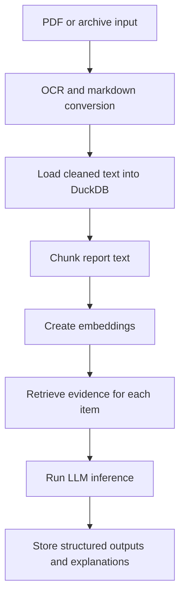

# Annual Report Pipeline

Research code for extracting structured variables from Vietnamese corporate annual reports and audited financial statements.

This repository supports a paper workflow built around retrieval-augmented LLM inference on report text. The current pipeline focuses on three outputs:

- `EDC`: checklist-style environmental disclosure variables
- `PROPER-VN`: environmental performance and rating variables
- governance extraction from annual-report narrative sections

The application also includes supporting utilities for document collection, PDF-to-markdown conversion, embedding generation, financial-statement ingestion, and audit-oriented evaluation.

## What this repository does

At a high level, the system:

1. collects annual-report or financial-statement source files
2. converts PDFs to markdown with OCR-aware processing
3. stores normalized text in DuckDB
4. splits reports into overlapping chunks and embeds them
5. retrieves evidence with HyDE-enhanced search
6. asks an LLM to produce structured research variables with traceable explanations



The annual-report retrieval and scoring flow is described in more detail in [ANNUAL_REPORT_PIPELINE_EXPLAINED.md](ANNUAL_REPORT_PIPELINE_EXPLAINED.md).

## Repository status

This is an active research codebase rather than a polished end-user package. It is suitable for inspection, replication, and extension, but you should expect project-specific assumptions in the database schema, data directories, and inference prompts.

What is included:

- the core pipeline code
- the NiceGUI dashboard used to run jobs and inspect pipeline state
- smoke-test style CLIs for targeted runs
- benchmark and methodology notes

What is not bundled automatically:

- API credentials
- a guarantee that third-party data files are redistributable
- pretrained model weights beyond externally hosted APIs and installed dependencies

## Requirements

- Python `>=3.13`
- `uv` for dependency management and execution
- an OpenAI API key for embedding and inference paths
- system support for the `marker-pdf` toolchain
- `unrar` on `PATH` if you want to process `.rar` financial-statement archives

Install project dependencies with:

```bash
uv sync
```

## Configuration

The app loads environment variables from `.env` in the repository root.

Minimum expected variables:

```env
OPENAI_API_KEY=your_key_here
INFERENCE_TEMPERATURE=0
```

Useful runtime knobs already supported by the codebase:

- `INFERENCE_TEMPERATURE`: defaults to `0`
- `HYDE2_ENABLED`: defaults to `1`
- `HYDE2_MODEL`: defaults to the main inference model
- `HYDE2_SYNTHETIC_DOC_COUNT`: defaults to `2`
- `INFERENCE_RETRIEVAL_ALPHA`, `INFERENCE_RETRIEVAL_BETA`, `INFERENCE_RETRIEVAL_GAMMA`
- `INFERENCE_RETRIEVAL_CANDIDATE_MULTIPLIER`

Current default modeling settings in the code:

- embedding model: `text-embedding-3-small`
- embedding dimensions: `1536`
- chunk size: `512` tokens
- chunk overlap: `128` tokens
- inference model: `gpt-4.1-mini`
- retrieval depth: top `20` chunks per item

## Quick start

Start the dashboard:

```bash
uv run python main.py
```

The dashboard is the main orchestration UI for conversion, ingestion, embedding, and inference jobs.

For an end-to-end annual-report inference path, the usual sequence is:

1. `Load Markdown to DB`
2. `Embed Annual Reports`
3. `Infer EDC`
4. `Infer PROPER-VN`
5. `Extract Governance`

## Command-line smoke workflow

Use the CLI for narrower validation or batch operations without opening the UI:

```bash
# Embed all loaded reports
uv run python smoke_llm.py embed-all

# Embed one ticker-year
uv run python smoke_llm.py embed-one --ticker VNM --year 2024

# Create all inference job types from existing embeddings
uv run python smoke_llm.py create-jobs

# Run one ticker-year end-to-end inference
uv run python smoke_llm.py infer-one --ticker VNM --year 2024

# Rescan markdown directory and update annual_reports in DB
uv run python smoke_llm.py rescan-markdown

# Preview only, limited to selected ticker/year
uv run python smoke_llm.py rescan-markdown --preview-only --tickers ASG --years 2025

# Fetch company-history milestones and compute firm age
uv run python smoke_llm.py sync-company-history --ticker SRF

# Run for multiple tickers
uv run python smoke_llm.py sync-company-history --tickers SRF VNM VJC
```

## Data and directory layout

Important top-level paths:

- [data/raw](data/raw): source files before conversion
- [data/markdown](data/markdown): converted annual-report markdown
- [data/markdown_financial_statement](data/markdown_financial_statement): converted audited financial-statement markdown
- [data/output](data/output): conversion outputs and derived artifacts
- [benchmarks](benchmarks): benchmark inputs and reports
- [tests](tests): targeted regression tests

The default database path is `db.db` in the repository root.

## Public-release notes

If you are using this repository for replication, keep in mind:

- some workflows depend on locally available source documents that may not be committed here
- LLM outputs are not fully deterministic across model revisions, even with low temperature settings
- third-party data access and redistribution rights should be checked separately from this code release
- benchmark reports in this repository reflect the code and model behavior available at the time they were generated

## Development and validation

This repository includes targeted tests in [tests](tests). When validating code changes locally, prefer the project environment:

```bash
uv run pytest
```

For narrow checks during development, use `uv run python ...` commands rather than a system Python interpreter.

## Related documents

- [ANNUAL_REPORT_PIPELINE_EXPLAINED.md](ANNUAL_REPORT_PIPELINE_EXPLAINED.md)
- [METHODOLOGY.md](METHODOLOGY.md)
- [PRD.md](PRD.md)
- [PRD_LLM.md](PRD_LLM.md)
- [PRD_RAG_IMPROVEMENT.md](PRD_RAG_IMPROVEMENT.md)

## Citation

If this repository supports a published or working paper, cite the paper and this code release together. Add the final bibliographic entry here when the manuscript details are public.
