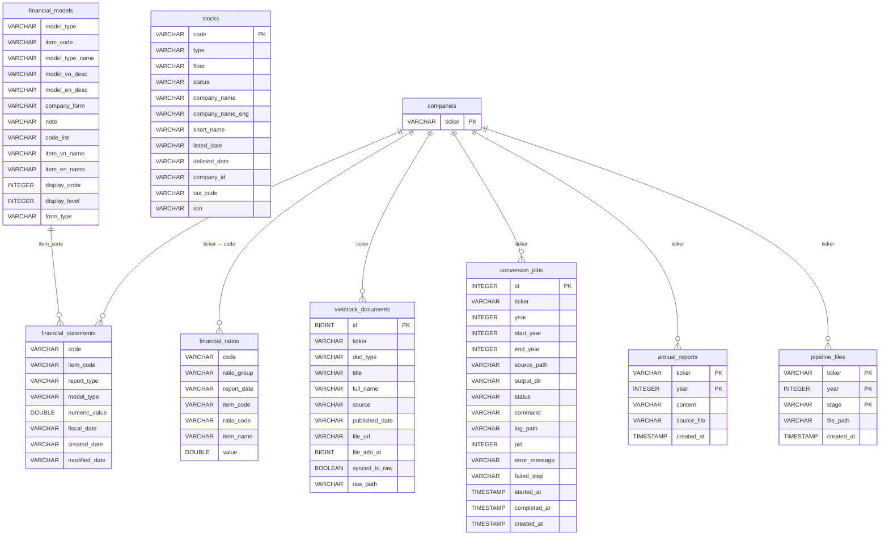

# Annual Report Pipeline

Vietnamese stock data & annual report pipeline with NiceGUI web UI.

## Database Schema

`companies` is the central control table. All pipeline operations are scoped to tickers in this table. Deleting a company cascades to all related data.

